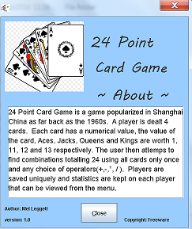
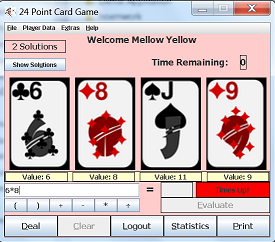
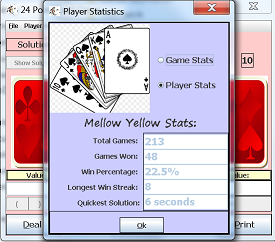
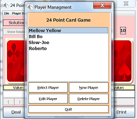

# 24-Point-Card-Game-java-
Popular card game from Shanghai China, 1960s

# Game Function
Uses a GUI to allow players to play the 24 point game  
Tracks user stats, shows possible solutions  
Allows for multiple users

# Sample Game

# Author
Mel Leggett 02/2017
